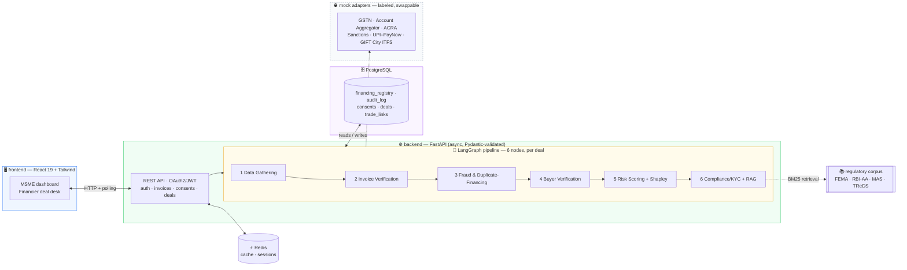

<div align="center">

# 🌉 VittSetu · वित्त सेतु

### The AI decisioning layer for Indian MSME export finance — a decision in ~2 minutes, not ~3 weeks

[](backend)
[](backend/app/pipeline)
[](docker-compose.yml)
[](backend/app/cache.py)
[](frontend)
[](#-quick-start)
[](backend/tests)

**[Quick start](#-quick-start) · [Demo script](#-demo-script-for-judges) · [The moat](#-the-moat-agentic-fraud-detection) · [Architecture](#-architecture) · [Real vs mocked](docs/README.md)**

</div>

---

## ✨ The problem, and what VittSetu does

Indian MSME exporters can't access fast, trustworthy working capital against their unpaid Singapore-bound invoices — so **cash-flow gaps, not demand, cap their growth**. Trade finance today is manual, weeks-long, and reserved for large corporates with collateral and credit history. Small first-time exporters are effectively locked out.

**VittSetu** (Hindi: *finance bridge*) is an AI agent that underwrites that financing instantly and explainably. It verifies the invoice, detects duplicate-financing fraud, and scores risk in minutes — on top of rails that already exist (GST e-invoicing, Account Aggregator, UPI–PayNow, GIFT City ITFS). A licensed financier disburses against the agent's decision, and the loan **auto-settles when the Singapore buyer pays** — turning a 30–90 day gap into same-day capital.

> VittSetu never lends its own money. It is the **missing decisioning layer**: payments, identity and invoicing already exist as live infrastructure.

## 🛡️ The moat: agentic fraud detection

Double-financing — pledging one invoice to two lenders — is a well-documented trade-finance fraud that **India has no shared registry to prevent**. That gap is the defensible core, and it's built for real here, in three independent layers:

| Layer | What it catches | Implementation |
|---|---|---|
| **1 · Lien registry (by IRN)** | The same invoice, resubmitted as-is | A real internal table of active liens, queried on every request, written on accept, released on repayment |
| **2 · Hash-anchored fingerprint** | The same *receivable* re-invoiced — new IRN, new number, reworded goods | SHA-256 over the invoice's economic identity (seller GSTIN · buyer UEN · amount · issue date), deliberately **excluding** the invoice number and IRN |
| **3 · Circular-trade graph** | Financing rings — A funds via B via C back to A | `trade_links` loaded into a **networkx** DiGraph; Johnson's-algorithm cycle scan halts any deal that closes a loop |

A plain duplicate lookup catches only layer 1. Both of the others are proven by tests, not asserted — see [`backend/tests/test_pipeline.py`](backend/tests/test_pipeline.py).

## 🧭 Architecture



The frontend holds **no business logic**. It creates a deal over HTTP and polls it — the live underwriting screen is a render of rows the backend just wrote to `audit_log`. Every step's reasoning is persisted, so the decision is auditable rather than a black-box score.

## 🚀 Quick start

### Option A — Docker Compose (everything, one command)

```bash
docker compose up --build
```

| | |
|---|---|
| 🖥️ **App** | http://localhost:5173 |
| 📖 **API docs** | http://localhost:8000/docs |
| 🗄️ PostgreSQL | `localhost:5432` · ⚡ Redis `localhost:6379` |

### Option B — local (no Docker; SQLite + in-process cache)

<table>
<tr><td width="50%" valign="top">

**1 · Backend** → `:8000`

```bash
cd backend
python -m venv .venv

# Windows
.venv\Scripts\pip install -r requirements.txt
.venv\Scripts\python run.py

# macOS / Linux
.venv/bin/pip install -r requirements.txt
.venv/bin/python run.py
```

</td><td width="50%" valign="top">

**2 · Frontend** → `:5173`

```bash
cd frontend
npm install
npm run dev
```

</td></tr>
</table>

Either way, the backend **seeds the three demo scenarios on first start**.

| Demo account | Credentials |
|---|---|
| 👤 Exporter (Saanvi Textiles) | `demo@saanvi.in` / `demo1234` |
| 🏦 Financier (Nexa Capital) | `fin@nexacapital.in` / `demo1234` |

## 🎬 Demo script (for judges)

1. Sign in as the exporter → **Dashboard**. Profile, stats and deal history are computed live from the database.
2. **Invoice A** · `INV-2026-0142` · Meridian Textiles · ₹20,00,000 → grant both consents (real rows; the API **403s** without them) → watch the six-node pipeline stream → **✅ APPROVED** at 80%, with a **Shapley contribution chart** showing exactly what moved the score and **regulatory citations** behind each compliance check → Accept. This places the deal on GIFT City ITFS and **registers a lien** anchored by both IRN and fingerprint.
3. **Invoice B** · `INV-2026-0156` · Straits Apparel · ₹34,00,000 → the fraud node queries the lien registry and **finds an active lien** (*Apex Trade Capital*, ref `TRD-2026-88412`), matched by **IRN + content fingerprint** → pipeline halts → **🚫 DECLINED** with the registry row as evidence.
   > The centerpiece. It genuinely catches the duplicate — the test suite proves it also catches a *re-invoiced* version with a brand-new IRN.
4. **Invoice C** · `INV-2026-0161` · Lion City Trading · ₹8,50,000 → 17-month-old buyer, zero payment history → **⚠️ CONDITIONAL** at 50% (the attribution chart shows *Relationship history* as the drag) → *Request manual review* → **Financier tab** → sign in → **Approve** with a note → back as the exporter, open the deal and Accept.
5. Financier tab → **"Simulate buyer payment"** → repayment settles, the lien releases, dashboard stats update.
6. The ↻ button resets and reseeds the database (and revokes all sessions).

## 🔬 Explainability, done properly

| | |
|---|---|
| **Exact Shapley attribution** | The scoring model is additive, so `φᵢ = componentᵢ(x) − componentᵢ(baseline)` is the closed-form Shapley value — the same quantity SHAP estimates by sampling, computed exactly. A test asserts `baseValue + Σφ ≈ score`. Renders as a signed contribution chart in both dashboards. |
| **RAG-grounded compliance** | The compliance node retrieves from a curated corpus (FEMA export realisation, RBI Account Aggregator consent, sanctions screening, duplicate financing, MSME KYC, GIFT City ITFS) via **BM25**, and cites `doc-id §section` in the trace and decision record. Swapping in FAISS/Weaviate means implementing one `Retriever` interface. |
| **Full audit trail** | Every node output, trace line and decision is an `audit_log` row, replayable per deal by both the exporter and the financier. |

## ✅ Tests

```bash
cd backend && .venv/Scripts/python -m pytest     # 8 passed
```

Beyond the three demo scenarios, the suite proves the two hard claims:

- **`test_resubmitted_invoice_caught_by_fingerprint_alone`** — re-issues the financed invoice with a **fresh IRN** (registered on the mock IRP, so verification genuinely passes), a new number and reworded goods. The IRN lookup misses; the fingerprint catches it.
- **`test_circular_trade_loop_halts_the_deal`** — one edge closes a loop through the deal's parties, and the otherwise-approvable Invoice A is halted by the graph scan.

Plus a 50-assertion end-to-end API suite (JWT revocation, role separation, consent gating, validation, settlement lifecycle).

## 📁 Repo map

<details>
<summary><strong>Expand</strong></summary>

```
backend/
├── run.py                     # local entrypoint → uvicorn :8000
├── Dockerfile
├── app/
│   ├── main.py                 # FastAPI app, CORS, auto-seed
│   ├── models.py                # every table
│   ├── seed_data.py              # the 3 scenarios as DATA (lien row, graph cycle, history)
│   ├── fingerprint.py             # hash-anchored invoice identity
│   ├── auth.py · secrets.py · cache.py    # JWT · secrets port · Redis(+fallback)
│   ├── pipeline/
│   │   ├── graph.py                 # LangGraph StateGraph + halt edges
│   │   ├── nodes.py                  # the 6 node implementations
│   │   ├── scoring.py                 # additive model + exact Shapley
│   │   ├── retriever.py                # BM25 over the reg corpus
│   │   └── explainer.py                 # plain-English decision record
│   ├── regs/                       # curated regulatory corpus (6 docs, 20 passages)
│   ├── adapters/                    # registry (REAL) + 6 labeled mocks
│   └── routers/                      # auth · invoices · consents · deals · financier · admin
└── tests/                       # pytest: fraud, cycles, attribution, retrieval
frontend/
├── Dockerfile · nginx.conf
└── src/
    ├── api.js · useUnderwriting.js    # fetch client · create-deal-then-poll
    └── components/                     # Login, Dashboard, Consent, Underwriting,
                                        # Offer, Declined, Disbursed, Financier
docs/README.md                    # ← what's real, what's mocked, how to swap
docker-compose.yml                # postgres + redis + backend + frontend
```

</details>

**Environment knobs** — `VS_DATABASE_URL` (Postgres/SQLite) · `REDIS_URL` (omit → in-process cache) · `VS_JWT_SECRET` · `VS_PACING=0` (instant runs for tests) · `VITE_API_URL` (frontend → API host).

## ⚠️ Scope

A hackathon prototype on **entirely synthetic data**. No real money moves; settlement and the external registries are labeled mock adapters. Full inventory and production-swap instructions: **[docs/README.md](docs/README.md)**.

---

<div align="center">

*VittSetu — वित्त सेतु — built for Smart India Hackathon.*

</div>
