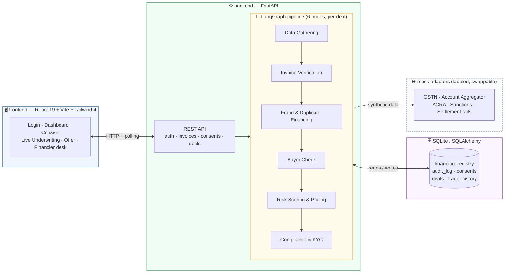

<div align="center">

# 🌉 TradeBridge AI

### AI-underwritten export invoice financing — decision in ~2 minutes, not ~3 weeks

[](backend)
[](backend/app/pipeline)
[](backend/app/models.py)
[](frontend)
[](frontend)
[](#-whats-real-vs-whats-mocked)

**[Quick start](#-quick-start) · [Demo script](#-demo-script-for-judges) · [Architecture](#-architecture) · [Real vs. mocked](#-whats-real-vs-whats-mocked) · [Repo map](#-repo-map)**

</div>

---

## ✨ What it does

Indian MSME exporters sign in, link an unpaid invoice to a Singapore buyer, grant two data-sharing consents, and watch a **server-side LangGraph pipeline** underwrite the deal live — pulling GST + bank data, verifying the government e-invoice (IRN), checking a **real lien registry for duplicate financing**, vetting the buyer, scoring the risk, and clearing compliance, with every step persisted to an audit log.

> **TradeBridge does not lend its own money.** It decides — a licensed partner financier disburses.

The centerpiece moment: two invoices go through the identical pipeline, and the agent treats them completely differently because the *data* differs — one sails through to an 80% advance, the other gets caught trying to double-pledge a receivable that's already financed elsewhere. Nothing is scripted; both outcomes **emerge from what's in the database**.

## 🧭 Architecture



The frontend holds **no business logic** — it creates a deal over HTTP and polls `/api/deals/{id}`. The live underwriting screen you watch stream is literally a render of rows the backend just wrote to `audit_log`.

## 🚀 Quick start

Two terminals. Requires **Python 3.11+** and **Node 18+**.

<table>
<tr>
<td width="50%" valign="top">

**1 · Backend** — API on `:8000`

```bash
cd backend
python -m venv .venv

# Windows
.venv\Scripts\pip install -r requirements.txt
.venv\Scripts\python run.py

# macOS / Linux
.venv/bin/pip install -r requirements.txt
.venv/bin/python run.py
```

First start creates `tradebridge.db` and seeds the demo data automatically.

</td>
<td width="50%" valign="top">

**2 · Frontend** — app on `:5173`

```bash
cd frontend
npm install
npm run dev
```

Point it at a different API host with `VITE_API_URL`.

</td>
</tr>
</table>

| | |
|---|---|
| 📖 **Interactive API docs** | http://localhost:8000/docs |
| 💚 **Health check** | http://localhost:8000/api/health |
| 👤 **Exporter demo** | `demo@saanvi.in` / `demo1234` |
| 🏦 **Financier demo** | `fin@nexacapital.in` / `demo1234` *(own sign-in, Financier tab)* |

## 🎬 Demo script (for judges)

1. Sign in as the exporter → **Dashboard** — company profile, stats and deal history are all computed live from the database.
2. **Invoice A** · `INV-2026-0142` · Meridian Textiles · ₹20,00,000 → grant both consents (real rows in `consents`; the API 403s without them) → watch the six-node pipeline stream → **✅ APPROVED**, ~80% advance → Accept. This **registers a lien** on the receivable in `financing_registry` — the invoice is now non-financeable.
3. **Invoice B** · `INV-2026-0156` · Straits Apparel · ₹34,00,000 → the Fraud node runs a real SQL query against the lien registry and **finds an active lien** (seeded: *Apex Trade Capital*, ref `TRD-2026-88412`) → pipeline halts → **🚫 DECLINED**, registry row shown as evidence.
   > This is the moat — it genuinely catches the duplicate. It isn't playing an animation.
4. **Invoice C** · `INV-2026-0161` · Lion City Trading · ₹8,50,000 → buyer is 17 months old with zero rows in `trade_history` → **⚠️ CONDITIONAL**, 50% advance → *Request manual review* → switch to the **Financier tab**, sign in, **Approve** with a note (writes back to the deal + audit log) → back as the exporter, open the deal and Accept.
5. In the Financier tab, hit **"Simulate buyer payment"** on a financed deal → repayment settles, the lien releases, dashboard stats update.
6. The ↻ button in the header resets and reseeds the whole database.

## 🔍 What's real vs. what's mocked

### ✅ Real — no mocks involved

| Capability | Where |
|---|---|
| **Persistence** — `msmes`, `buyers`, `invoices`, `financing_deals`, `consents`, `financing_registry`, `trade_history`, `audit_log`, `users`/`tokens` | [`app/models.py`](backend/app/models.py) *(SQLite by default; set `TB_DATABASE_URL` for Postgres)* |
| **Duplicate-financing detection** — the fraud node queries `financing_registry`; accepting writes a lien; repayment releases it | [`app/adapters/registry.py`](backend/app/adapters/registry.py) |
| **Agent orchestration** — a LangGraph `StateGraph`, 6 nodes, conditional halt edges, run server-side per deal | [`app/pipeline/graph.py`](backend/app/pipeline/graph.py) |
| **Explainability** — every node start, trace line, finding and decision is a row in `audit_log`; the UI renders what it reads back | [`app/audit.py`](backend/app/audit.py) |
| **Consent enforcement** — deal creation 403s without active consents; the pipeline re-checks before pulling data | [`app/routers/deals.py`](backend/app/routers/deals.py) |
| **Risk scoring** — feature-weighted score over computed inputs: GST filing ratio, cash-flow stability (σ/μ), buyer age, on-time ratio, invoice-to-inflow concentration | [`app/pipeline/scoring.py`](backend/app/pipeline/scoring.py) |
| **Auth & roles** — salted-PBKDF2 passwords, bearer tokens, `msme` vs `financier` guards | [`app/auth.py`](backend/app/auth.py) |
| **Financier write-backs** — approve/decline overrides and repayment simulation mutate the deal, registry and audit log | [`app/routers/financier.py`](backend/app/routers/financier.py) |

### 🧪 Mocked — clearly labeled `# MOCK ADAPTER`, same interface as production

| Adapter | File | Production swap |
|---|---|---|
| GST profile + IRN verification | [`adapters/gstn.py`](backend/app/adapters/gstn.py) | GSTN e-invoice registry (IRP) + GST returns via a licensed GSP |
| Bank summary *(consent-gated)* | [`adapters/account_aggregator.py`](backend/app/adapters/account_aggregator.py) | RBI Account Aggregator FIU integration (Sahamati) |
| Singapore buyer lookup | [`adapters/acra.py`](backend/app/adapters/acra.py) | ACRA entity search + trade-credit bureau |
| Sanctions screening | [`adapters/sanctions.py`](backend/app/adapters/sanctions.py) | OFAC / UN / MAS screening vendor |
| Disbursal & repayment rails | [`adapters/settlement.py`](backend/app/adapters/settlement.py) | Partner-NBFC payout API · UPI–PayNow corridor — **no real money moves** |

The synthetic "outside world" those mocks serve lives in [`app/demo_world.py`](backend/app/demo_world.py).

> ⚠️ **Deliberately simplified:** no real money movement; no production security hardening (KYC/AML vendor, encryption-at-rest, rate limiting — marked in code comments where they'd plug in); single-tenant, no horizontal scaling. `POST /api/admin/reset` is intentionally unauthenticated — demo convenience only.

> 🤖 **Optional LLM polish:** decision bullets are templated over real, computed facts. Set `ANTHROPIC_API_KEY` and `pip install anthropic` and [`pipeline/explainer.py`](backend/app/pipeline/explainer.py) has Claude rewrite them at decision time — the app is fully functional without it.

## 🗂️ Repo map

<details>
<summary><strong>Click to expand the full tree</strong></summary>

```
backend/
├── run.py                    # python run.py → uvicorn on :8000
├── app/
│   ├── main.py                # FastAPI app, CORS, auto-seed on first start
│   ├── models.py               # every table
│   ├── seed_data.py             # the three scenarios as DATA — lien row, trade history, buyers
│   ├── pipeline/                # LangGraph graph, 6 node implementations, scoring, explainer
│   ├── adapters/                 # registry (real) + 5 mock adapters
│   └── routers/                   # auth, invoices, consents, deals, financier, admin
frontend/
├── src/
│   ├── api.js                 # fetch client + token storage
│   ├── useUnderwriting.js       # POST /deals then poll — UI renders the audit log
│   └── components/               # Login, Dashboard, SelectInvoice, Consent, Underwriting,
│                                  # Offer, Declined, Disbursed, Financier (deal desk)
```

</details>

**Environment knobs**

| Variable | Effect |
|---|---|
| `TB_PACING=0` | Makes pipeline runs instant (useful for tests) |
| `TB_DATABASE_URL` | Swaps the database (e.g. to Postgres) |
| `VITE_API_URL` | Points the frontend at a non-default API host |

---

<div align="center">

*Built for SIH — a hackathon prototype on entirely synthetic data.*

</div>
