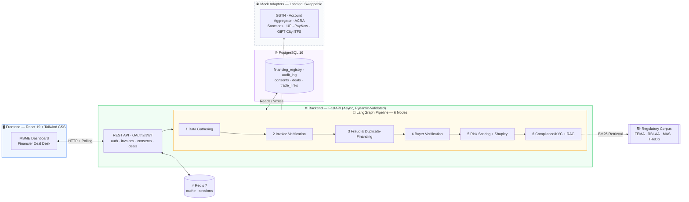

<div align="center">

<br/>

# 🌉 VittSetu · वित्त सेतु

### *Bridging Finance for India's MSME Exporters*

> **An AI-powered decisioning layer that underwrites export trade finance in ~2 minutes — replacing a ~3-week manual process.**

<br/>

[](backend)
[](backend/app/pipeline)
[](frontend)
[](docker-compose.yml)
[](backend/app/cache.py)
[](#-getting-started)
[](backend/tests)
[](LICENSE)

<br/>

[**Getting Started**](#-getting-started) · [**Key Features**](#-key-features) · [**Architecture**](#-system-architecture) · [**Demo Walkthrough**](#-demo-walkthrough) · [**Testing**](#-testing--validation) · [**Documentation**](docs/README.md)

<br/>

</div>

---

## 📋 Table of Contents

- [Overview](#-overview)
- [Problem Statement](#-problem-statement)
- [Key Features](#-key-features)
- [System Architecture](#-system-architecture)
- [Technology Stack](#-technology-stack)
- [Getting Started](#-getting-started)
- [Demo Walkthrough](#-demo-walkthrough)
- [Explainability & Compliance](#-explainability--compliance)
- [Testing & Validation](#-testing--validation)
- [Project Structure](#-project-structure)
- [Configuration](#%EF%B8%8F-configuration)
- [Scope & Disclaimer](#-scope--disclaimer)
- [Contributing](#-contributing)
- [Acknowledgements](#-acknowledgements)

---

## 🔍 Overview

**VittSetu** (Hindi: *वित्त सेतु — Finance Bridge*) is an intelligent underwriting platform designed to unlock instant working-capital financing for Indian MSME exporters against their unpaid Singapore-bound invoices.

The platform acts as the **missing decisioning layer** between existing financial infrastructure — GST e-invoicing, RBI Account Aggregator, UPI–PayNow, and GIFT City ITFS — delivering explainable, auditable credit decisions in minutes rather than weeks. A licensed financier disburses against the agent's decision, and the loan **auto-settles when the overseas buyer pays**.

> [!NOTE]
> VittSetu does not lend its own funds. It provides the AI-driven risk assessment and fraud detection layer that enables financiers to make informed, rapid decisions on MSME trade-finance applications.

---

## 🎯 Problem Statement

Indian MSME exporters face a critical challenge: **cash-flow gaps — not demand — cap their growth.**

| Challenge | Current State | With VittSetu |
|:--|:--|:--|
| **Turnaround Time** | ~3 weeks (manual underwriting) | ~2 minutes (AI-driven) |
| **Accessibility** | Reserved for large corporates with collateral | Open to first-time MSME exporters |
| **Fraud Prevention** | No shared duplicate-financing registry in India | Three-layer agentic fraud detection |
| **Explainability** | Black-box scoring | Exact Shapley attribution + regulatory citations |
| **Settlement** | Manual reconciliation | Auto-settlement on buyer payment |

Trade finance today is manual, weeks-long, and gatekept by collateral requirements — effectively locking out the small exporters who need it most.

---

## ✨ Key Features

### 🤖 Agentic AI Underwriting Pipeline

A **six-node LangGraph StateGraph** orchestrates the entire underwriting decision per deal:

1. **Data Gathering** — Collects GST profile, bank summaries (consent-gated via Account Aggregator), and trade history
2. **Invoice Verification** — Validates IRN against the GST e-invoice registry (IRP)
3. **Fraud & Duplicate-Financing Detection** — Three-layer fraud scan (see below)
4. **Buyer Verification** — ACRA entity lookup + sanctions screening + relationship history
5. **Risk Scoring + Shapley Attribution** — Additive risk model with exact closed-form Shapley values
6. **Compliance/KYC + RAG** — BM25 retrieval over curated regulatory corpus (FEMA, RBI-AA, MAS, TReDS, GIFT City ITFS)

### 🛡️ Three-Layer Fraud Detection (The Defensive Moat)

Double-financing — pledging one invoice to multiple lenders — is a well-documented trade-finance fraud, and **India currently lacks a shared registry to prevent it**. VittSetu addresses this with three independent, complementary detection layers:

| Layer | Threat Mitigated | Mechanism |
|:--|:--|:--|
| **1. Lien Registry (IRN)** | Same invoice resubmitted as-is | Internal table of active liens; queried on every request, written on accept, released on repayment |
| **2. Hash-Anchored Fingerprint** | Same receivable re-invoiced with a new IRN, new number, reworded goods | SHA-256 hash over economic identity (seller GSTIN · buyer UEN · amount · issue date), deliberately **excluding** invoice number and IRN |
| **3. Circular-Trade Graph Analysis** | Financing rings (A → B → C → A) | `trade_links` loaded into a **NetworkX DiGraph**; Johnson's algorithm cycle scan halts any deal that closes a loop |

> [!IMPORTANT]
> Both Layer 2 and Layer 3 are **proven by automated tests**, not merely asserted. See [`test_pipeline.py`](backend/tests/test_pipeline.py) for the test implementations.

### 📊 Explainable AI Decisions

- **Exact Shapley Attribution** — The scoring model is additive, enabling closed-form Shapley value computation (`φᵢ = componentᵢ(x) − componentᵢ(baseline)`). Renders as a signed contribution chart.
- **RAG-Grounded Compliance** — BM25 retrieval over a curated corpus of six regulatory documents (20 section-level passages). Every compliance check cites `doc-id §section`.
- **Full Audit Trail** — Every node output, trace line, and decision is persisted as an `audit_log` row, replayable per deal.

### 🔐 Security & Consent

- **OAuth2/JWT Authentication** — HS256 bearer tokens, PBKDF2-salted passwords, role-based route guards (`msme` / `financier`)
- **Consent Enforcement** — Real consent records with scope, reference, and expiry. API returns **403** without valid consent; the pipeline node independently re-verifies before any data pull.

---

## 🏗️ System Architecture



> The frontend holds **no business logic**. It creates a deal over HTTP and polls for updates — the live underwriting screen renders rows the backend writes to `audit_log`. Every step's reasoning is persisted, making the decision fully auditable.

---

## 🔧 Technology Stack

| Layer | Technology | Purpose |
|:--|:--|:--|
| **Backend Framework** | FastAPI ≥ 0.115 | Async REST API with Pydantic validation |
| **Agent Orchestration** | LangGraph ≥ 0.2 | Six-node StateGraph for underwriting pipeline |
| **Frontend** | React 19 + Vite 6 | MSME Dashboard & Financier Deal Desk |
| **Styling** | Tailwind CSS 4 | Responsive, utility-first UI |
| **Database** | PostgreSQL 16 (Docker) / SQLite (local) | Persistent system of record |
| **Cache** | Redis 7 (Docker) / In-process fallback (local) | Session state & deal payload caching |
| **Graph Analysis** | NetworkX ≥ 3.2 | Circular-trade detection via Johnson's algorithm |
| **Information Retrieval** | rank-bm25 ≥ 0.2.2 | BM25 retrieval over regulatory corpus |
| **Authentication** | PyJWT ≥ 2.8 | OAuth2-style HS256 bearer tokens |
| **Containerisation** | Docker Compose | One-command full-stack deployment |
| **Testing** | pytest ≥ 8.0 | Unit + end-to-end test suite |

---

## 🚀 Getting Started

### Prerequisites

- **Docker & Docker Compose** (recommended) — OR —
- **Python 3.11+** and **Node.js 18+** (for local development)

### Option A — Docker Compose *(Recommended)*

Launch the entire stack with a single command:

```bash
docker compose up --build
```

Once running, access the application at:

| Service | URL |
|:--|:--|
| 🖥️ **Application** | [http://localhost:5173](http://localhost:5173) |
| 📖 **API Documentation** | [http://localhost:8000/docs](http://localhost:8000/docs) |
| 🗄️ **PostgreSQL** | `localhost:5432` |
| ⚡ **Redis** | `localhost:6379` |

### Option B — Local Development *(No Docker)*

<table>
<tr><td width="50%" valign="top">

**1. Backend** → `:8000`

```bash
cd backend
python -m venv .venv

# Windows
.venv\Scripts\pip install -r requirements.txt
.venv\Scripts\python run.py

# macOS / Linux
.venv/bin/pip install -r requirements.txt
.venv/bin/python run.py
```

</td><td width="50%" valign="top">

**2. Frontend** → `:5173`

```bash
cd frontend
npm install
npm run dev
```

</td></tr>
</table>

> [!TIP]
> The backend **automatically seeds three demo scenarios** on first start — no manual database setup is required. Local mode uses SQLite and an in-process cache, eliminating the need for PostgreSQL and Redis.

### Demo Credentials

| Account | Email | Password |
|:--|:--|:--|
| 👤 **Exporter** (Saanvi Textiles) | `demo@saanvi.in` | `demo1234` |
| 🏦 **Financier** (Nexa Capital) | `fin@nexacapital.in` | `demo1234` |

---

## 🎬 Demo Walkthrough

The following walkthrough demonstrates VittSetu's three core scenarios, each designed to showcase a distinct underwriting outcome:

### Scenario 1 — ✅ Approved (Clean Invoice)

1. Sign in as the **Exporter** → Navigate to the **Dashboard**
2. Select **Invoice A** (`INV-2026-0142` · Meridian Textiles · ₹20,00,000)
3. Grant both required consents *(the API enforces 403 without them)*
4. Observe the six-node pipeline execute in real time
5. **Result:** ✅ **APPROVED** at 80% — with a **Shapley contribution chart** showing exactly what moved the score and **regulatory citations** behind each compliance check
6. Accept the offer → the deal is placed on GIFT City ITFS and a **lien is registered** (anchored by both IRN and fingerprint)

### Scenario 2 — 🚫 Declined (Duplicate-Financing Detected)

1. Select **Invoice B** (`INV-2026-0156` · Straits Apparel · ₹34,00,000)
2. The fraud node queries the lien registry and **detects an active lien** (Apex Trade Capital, ref `TRD-2026-88412`), matched by **IRN + content fingerprint**
3. **Result:** 🚫 **DECLINED** — with the registry row presented as evidence

> [!IMPORTANT]
> This is the centrepiece scenario. The fraud detection genuinely catches the duplicate, and the test suite additionally proves it catches a *re-invoiced* variant with a brand-new IRN.

### Scenario 3 — ⚠️ Conditional (High Risk, Manual Review)

1. Select **Invoice C** (`INV-2026-0161` · Lion City Trading · ₹8,50,000)
2. Buyer has only 17-month history and zero payment track record
3. **Result:** ⚠️ **CONDITIONAL** at 50% — the attribution chart highlights *Relationship History* as the primary drag factor
4. Request manual review → Switch to **Financier** tab → Sign in → **Approve** with a note
5. Return as the exporter → Open the deal → Accept

### Settlement & Reset

- **Financier tab** → **"Simulate buyer payment"** → Repayment settles, lien releases, dashboard stats update in real time
- Use the **↻ button** to reset and reseed the database (revokes all sessions)

---

## 🔬 Explainability & Compliance

VittSetu is designed with **auditability as a first-class requirement**, not an afterthought:

| Capability | Description |
|:--|:--|
| **Exact Shapley Attribution** | The scoring model is additive, so `φᵢ = componentᵢ(x) − componentᵢ(baseline)` is the closed-form Shapley value — the same quantity SHAP estimates by sampling, but computed exactly. A test asserts `baseValue + Σφ ≈ score`. Renders as a signed contribution chart in both dashboards. |
| **RAG-Grounded Compliance** | The compliance node retrieves from a curated corpus (FEMA export realisation, RBI Account Aggregator consent, sanctions screening, duplicate financing, MSME KYC, GIFT City ITFS) via **BM25**, citing `doc-id §section` in the trace and decision record. Swapping in FAISS/Weaviate requires implementing a single `Retriever` interface. |
| **Full Audit Trail** | Every node output, trace line, and decision is persisted as an `audit_log` row — replayable per deal by both the exporter and the financier. |

---

## ✅ Testing & Validation

### Running Tests

```bash
cd backend && .venv/Scripts/python -m pytest    # 8 unit tests passed
```

### Critical Test Cases

Beyond the three demo scenarios, the test suite **proves the two hard claims** with automated verification:

| Test | What It Proves |
|:--|:--|
| `test_resubmitted_invoice_caught_by_fingerprint_alone` | Re-issues the financed invoice with a **fresh IRN** (registered on the mock IRP, so verification genuinely passes), a new number, and reworded goods. The IRN lookup misses; the **fingerprint catches it**. |
| `test_circular_trade_loop_halts_the_deal` | Adds one edge closing a loop through the deal's parties, then runs the otherwise-clean Invoice A. The **graph scan halts it**. |

Additionally, a **50-assertion end-to-end API suite** covers JWT revocation, role separation, consent gating, validation errors, and the complete settlement lifecycle.

---

## 📁 Project Structure

<details>
<summary><strong>Click to expand full directory tree</strong></summary>

```
vittsetu/
├── docker-compose.yml                # Full-stack orchestration (PostgreSQL + Redis + Backend + Frontend)
│
├── backend/
│   ├── run.py                        # Local entrypoint → uvicorn :8000
│   ├── Dockerfile                    # Production container build
│   ├── requirements.txt              # Python dependencies
│   ├── pytest.ini                    # Test configuration
│   ├── app/
│   │   ├── main.py                   # FastAPI app initialisation, CORS, auto-seed
│   │   ├── models.py                 # SQLAlchemy ORM models (all tables)
│   │   ├── seed_data.py              # Three demo scenarios (lien row, graph cycle, history)
│   │   ├── fingerprint.py            # SHA-256 hash-anchored invoice identity
│   │   ├── auth.py                   # JWT authentication + role-based guards
│   │   ├── secrets.py                # Secrets provider port (env vars → swappable)
│   │   ├── cache.py                  # Redis with transparent in-process fallback
│   │   ├── pipeline/
│   │   │   ├── graph.py              # LangGraph StateGraph + conditional halt edges
│   │   │   ├── nodes.py              # Six node implementations
│   │   │   ├── scoring.py            # Additive risk model + exact Shapley decomposition
│   │   │   ├── retriever.py          # BM25 retrieval over regulatory corpus
│   │   │   └── explainer.py          # Plain-English decision record generator
│   │   ├── regs/                     # Curated regulatory corpus (6 docs, 20 passages)
│   │   ├── adapters/                 # Lien registry (REAL) + 6 labeled mock adapters
│   │   └── routers/                  # API routes: auth · invoices · consents · deals · financier · admin
│   └── tests/                        # pytest: fraud, cycles, attribution, retrieval
│
├── frontend/
│   ├── Dockerfile                    # Nginx-based production container
│   ├── nginx.conf                    # Reverse proxy configuration
│   ├── package.json                  # Node.js dependencies
│   ├── vite.config.js                # Vite build configuration
│   └── src/
│       ├── api.js                    # HTTP fetch client
│       ├── useUnderwriting.js        # Create-deal-then-poll hook
│       └── components/               # Login, Dashboard, Consent, Underwriting,
│                                     # Offer, Declined, Disbursed, Financier
│
└── docs/
    └── README.md                     # What's real vs. mocked + production swap guide
```

</details>

---

## ⚙️ Configuration

The following environment variables control runtime behaviour:

| Variable | Description | Default |
|:--|:--|:--|
| `VS_DATABASE_URL` | PostgreSQL or SQLite connection string | SQLite (local) |
| `REDIS_URL` | Redis connection URL (omit for in-process cache) | — |
| `VS_JWT_SECRET` | Secret key for JWT token signing | Dev secret |
| `VS_PACING` | Pipeline pacing delay in seconds (`0` for instant test runs) | `1.0` |
| `VITE_API_URL` | Frontend → Backend API host | `http://localhost:8000` |

---

## ⚠️ Scope & Disclaimer

> [!CAUTION]
> **This is a hackathon prototype built on entirely synthetic data.** No real money moves; settlement and all external registries are labeled mock adapters. This software is not intended for production financial operations.

Key limitations:

- **No real money movement** — Settlement is mocked end-to-end
- **No production security hardening** — No real KYC/AML vendor, no penetration testing, no encryption-at-rest, no rate limiting
- **No multi-tenancy, load testing, or horizontal scaling**
- **Regulatory corpus** contains curated prototype summaries, not verbatim legislation

For a complete inventory of what is real vs. mocked, and detailed production swap instructions, refer to **[docs/README.md](docs/README.md)**.

---

## 🤝 Contributing

Contributions are welcome. Please follow these guidelines:

1. **Fork** the repository
2. **Create** a feature branch (`git checkout -b feature/your-feature-name`)
3. **Commit** your changes with descriptive messages (`git commit -m "feat: add new feature"`)
4. **Push** to your branch (`git push origin feature/your-feature-name`)
5. **Open** a Pull Request with a clear description of changes

---

## 🙏 Acknowledgements

- **Singapore India Hackathon (SIH)** — for providing the platform and problem statement
- **LangGraph** — for the agentic orchestration framework
- **FastAPI** — for the high-performance async API layer
- **React** — for the responsive frontend framework

---

<div align="center">

<br/>

**VittSetu** · वित्त सेतु · *Finance Bridge*

Built with ❤️ for **Singapore India Hackathon**

<br/>

*Empowering India's MSME exporters with AI-driven trade finance.*

<br/>

</div>
